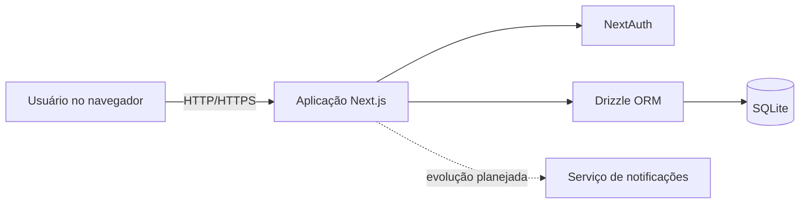

# Arquitetura

## Visão arquitetural

O projeto adota uma arquitetura **cliente-servidor**. O navegador apresenta a interface e envia solicitações ao servidor Next.js, responsável pela autenticação, regras de negócio e acesso aos dados.

## Organização lógica

| Camada | Responsabilidade | Tecnologias |
|---|---|---|
| Interface | Páginas, componentes e experiência dos usuários. | React, Next.js, TypeScript, CSS |
| Aplicação | Actions, rotas, validações e regras de negócio. | Next.js Server Actions e API Routes |
| Autenticação | Sessões e controle de acesso por perfil. | NextAuth |
| Persistência | Modelagem e consultas ao banco. | Drizzle ORM e SQLite |

## Controle de acesso

A aplicação separa as rotas de acordo com o perfil autenticado:

- `/dashboard`: área do estudante;
- `/gestao`: área do gestor RU;
- `/admin`: área administrativa.

A aplicação organiza a navegação por sessão e perfil. As validações de autorização no servidor seguem em evolução junto às funcionalidades protegidas.

## Modelo de dados

O esquema contempla usuários, sessões, pratos, cardápios diários, avaliações, restrições alimentares e relacionamentos de favoritos. Essa estrutura permite associar preferências e restrições ao estudante autenticado sem expor informações de outros usuários.

## Implantação planejada

O documento de arquitetura prevê execução da aplicação Next.js em infraestrutura de nuvem, com comunicação por HTTPS e persistência SQLite. O GitHub Pages hospeda apenas esta documentação estática; a aplicação completa necessita de um ambiente com suporte ao servidor Next.js.

## Metas arquiteturais

- separação de responsabilidades entre interface, regras e persistência;
- evolução independente dos módulos;
- consistência e integridade dos dados;
- navegação responsiva;
- curva de aprendizado compatível com o cronograma da disciplina.

Consulte os diagramas e decisões completas no [Documento de Arquitetura](Doc_Arquitetura_Grupo_Brooks.PDF).
