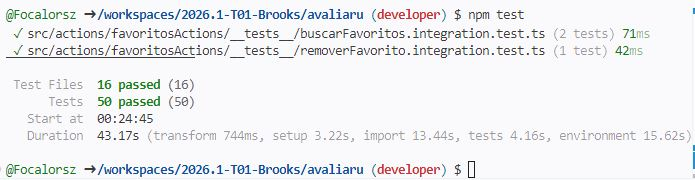

# Qualidade e testes

## Estratégia

A qualidade do AvaliaRU deve ser observada por verificação técnica e validação com os usuários. O planejamento oficial contempla testes unitários, de integração, de sistema e de usabilidade.

## Cenários prioritários

| ID | Cenário | Critério principal |
|---|---|---|
| CT01 | Exibição do cardápio | Apresentar corretamente refeições e acompanhamentos. |
| CT02 | Alertas de restrição | Destacar pratos incompatíveis com as restrições cadastradas. |
| CT03 | Cadastro de favoritos | Registrar e recuperar as preferências do estudante. |
| CT04 | Notificação de favorito | Avisar quando um prato favorito estiver disponível. |
| CT05 | Registro de avaliação | Persistir nota e comentário e confirmar o envio. |
| CT06 | Usabilidade mobile | Manter navegação e controles sem quebra de layout. |

## Métricas

- débito técnico acumulado;
- densidade de defeitos por funcionalidade;
- cobertura de testes automatizados;
- tempo médio de resposta;
- taxa de sucesso das notificações;
- adesão dos usuários às funcionalidades de valor.

## Resultados obtidos

### CT01 - Exibição do cardápio

Status: Aprovado

Resultado:
- refeições exibidas corretamente;
- acompanhamentos exibidos corretamente;
- dados persistidos após atualização.

### CT02 - Alertas de restrição

Status: Aprovado

Resultado:
- pratos incompatíveis destacados corretamente;
- restrições alimentares consideradas na renderização.

### CT03 - Cadastro de favoritos

Status: Aprovado

Resultado:
- favorito salvo com sucesso;
- favorito recuperado após novo acesso.

### CT04 - Notificação de favorito

Status: Aprovado

Resultado:
- notificação enviada quando prato favorito foi disponibilizado.

### CT05 - Registro de avaliação

Status: Aprovado

Resultado:
- nota armazenada corretamente;
- comentário persistido no banco.

### CT06 - Usabilidade mobile

Status: Aprovado

Resultado:
- interface responsiva;
- navegação funcional em resolução móvel.

## Testes existentes

O repositório já possui testes iniciais de actions relacionados ao cadastro de cardápio e prato do dia. Os testes automatizados existentes foram utilizados como mecanismo de verificação contínua durante o desenvolvimento. A equipe realizou correções nos cenários identificados e definiu a ampliação futura da cobertura para novos módulos. A cobertura de testes geral do projeto se encontra demonstrada na imagem a baixo.

